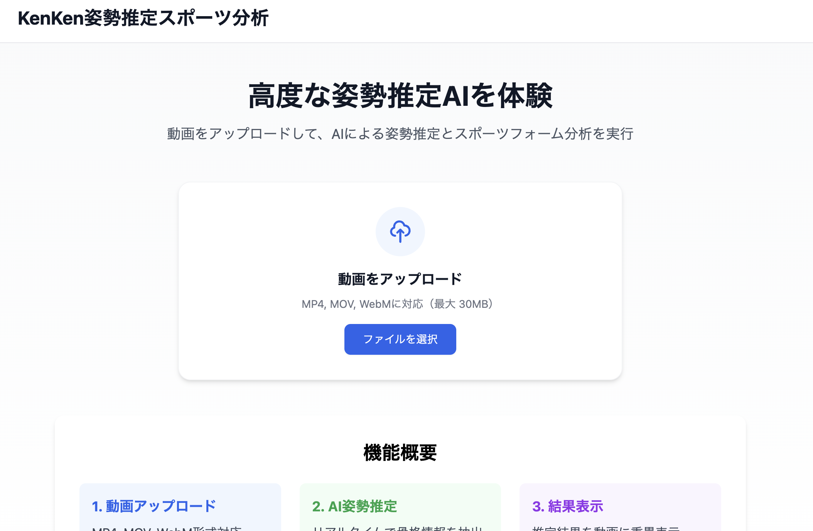
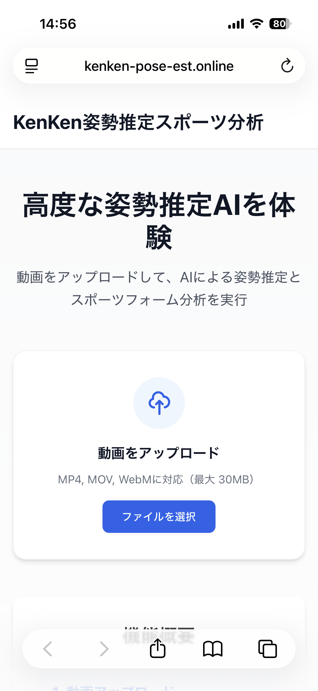
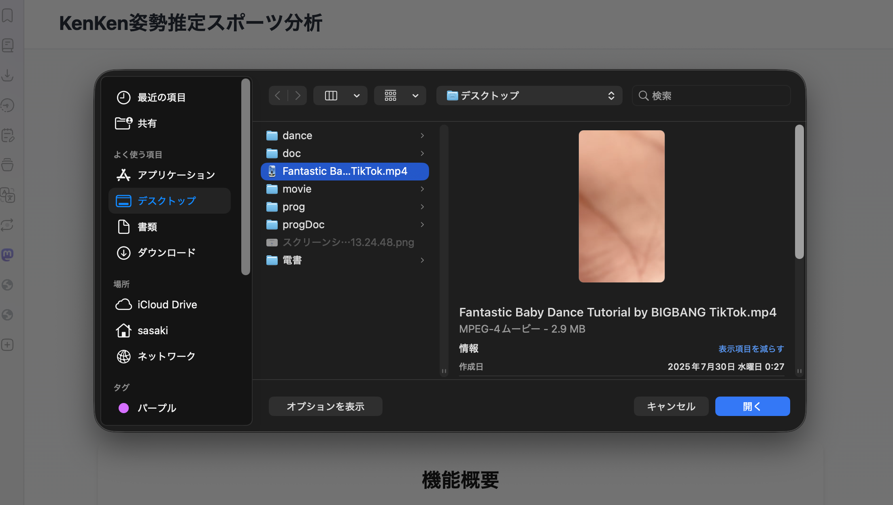
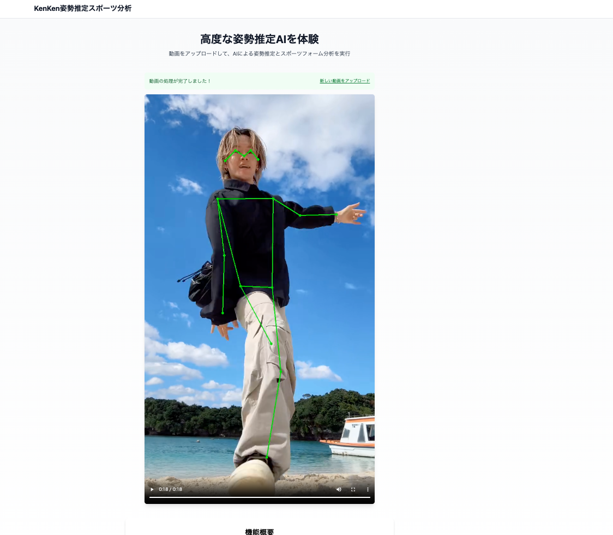
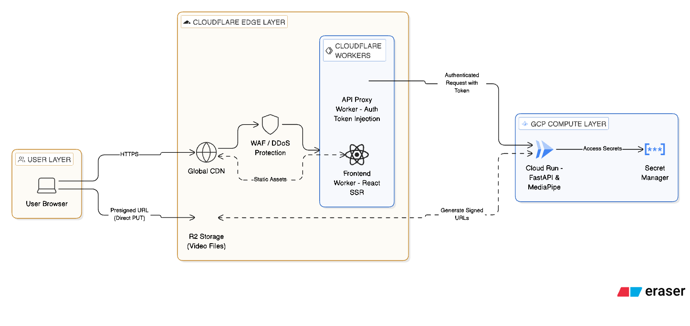

# KenKen 姿勢推定スポーツ分析

動画をアップロードしてAIによる姿勢推定とスポーツフォーム分析を行うWebアプリケーションです。

[](https://kenken-pose-est.online)
[](#テスト戦略)
[](https://www.typescriptlang.org/)
[](https://reactrouter.com/)

> **Live Demo**: [kenken-pose-est.online](https://kenken-pose-est.online)

---

## プロジェクトのハイライト

| カテゴリ           | こだわりポイント                                            |
| ------------------ | ----------------------------------------------------------- |
| **パフォーマンス** | Cloudflare Workers によるエッジ SSR で TTFB 50ms 以下を実現 |
| **品質**           | TDD を徹底し、テストカバレッジ 94% を維持                   |
| **DX**             | CI/CD 最適化により、PR ごとに 2-3 分で品質チェック完了      |
| **セキュリティ**   | 環境変数の厳密な分離、CORS/CSP の適切な設定                 |

---

## アプリケーションデモ

### 画面表示

|                 PC 版                  |                   モバイル版                   |
| :------------------------------------: | :--------------------------------------------: |
|  |  |

### ファイルアップロード〜姿勢推定

|                ファイル選択                 |               姿勢推定結果               |
| :-----------------------------------------: | :--------------------------------------: |
|  |  |

### 処理後の動画


---

## アーキテクチャ概要



> **詳細なインフラ構成**: [pose-est-infra-2025](https://github.com/kenken-201/pose-est-infra-2025) を参照

### システムフロー

```
┌─────────────┐    ┌──────────────────────┐    ┌─────────────────┐
│   Browser   │───▶│  Cloudflare Workers  │───▶│   Cloud Run     │
│             │    │  (React Router SSR)  │    │  (FastAPI + ML) │
└─────────────┘    └──────────────────────┘    └────────┬────────┘
                                                        │
                   ┌──────────────────────┐             │
                   │    Cloudflare R2     │◀────────────┘
                   │  (Video Storage)     │
                   └──────────────────────┘
```

1. **SSR**: Cloudflare Workers 上で React Router v7 が初期 HTML をレンダリング
2. **状態管理**: クライアント状態 (Zustand) とサーバー状態 (TanStack Query) を分離
3. **動画処理**: アップロード → 姿勢推定 → R2 保存 → 署名付き URL で配信

---

## 技術スタック

| カテゴリ         | 技術               | 選定理由                                                 |
| ---------------- | ------------------ | -------------------------------------------------------- |
| **Framework**    | React Router v7    | SSR + Cloudflare Workers ネイティブサポート              |
| **Server State** | TanStack Query     | キャッシュ戦略、自動再取得、ローディング/エラー状態管理  |
| **Client State** | Zustand            | 軽量 (2KB)、ボイラープレートレス、React 外からアクセス可 |
| **Styling**      | TailwindCSS        | ユーティリティファースト、ビルド時の最適化               |
| **Hosting**      | Cloudflare Workers | エッジ実行、グローバル CDN、コスト効率                   |
| **Testing**      | Vitest + RTL       | Vite 統合、高速 HMR、Jest 互換 API                       |

---

## セキュリティへのこだわり

<details>
<summary><strong>環境変数管理</strong></summary>

- 機密情報は **Cloudflare Secrets** で管理（Dashboard 経由）
- クライアントバンドルには `VITE_` プレフィックス付きの**公開可能な値のみ**含める
- サーバーサイド専用変数は `wrangler.jsonc` の `vars` で定義

</details>

<details>
<summary><strong>CORS 設計</strong></summary>

- バックエンド API は許可オリジンのみ受け入れ（`https://kenken-pose-est.online` 等）
- プリフライトリクエスト対応、クレデンシャル付きリクエストサポート

</details>

<details>
<summary><strong>クライアントバンドルの安全性</strong></summary>

- API キー/シークレットはクライアントコードに**絶対に含めない**
- 署名付き URL で R2 への直接アクセスを時間制限付きで許可

</details>

---

## パフォーマンス最適化

<details>
<summary><strong>レンダリング戦略</strong></summary>

- **SSR**: 初回ロード時に完全な HTML を返し、FCP を高速化
- **ハイドレーション**: SSR 後にクライアントで React がアタッチ

</details>

<details>
<summary><strong>コード分割とバンドル最適化</strong></summary>

- React Router のルートベース分割で必要なコードのみロード
- 動的インポートで大きなライブラリを遅延ロード
- TailwindCSS の PurgeCSS で未使用スタイル削除
- Tree Shaking で不要な JavaScript を除去

</details>

<details>
<summary><strong>エッジデプロイ</strong></summary>

- Cloudflare Workers は世界 300+ のエッジロケーションで実行
- 日本ユーザーには日本のエッジノードから配信

</details>

---

## テスト戦略

**カバレッジ**: 94% (目標 90%+)

| ツール                    | 用途                                |
| ------------------------- | ----------------------------------- |
| **Vitest**                | 単体テスト (hooks, utils, stores)   |
| **React Testing Library** | コンポーネントテスト (ユーザー視点) |
| **happy-dom**             | 軽量 DOM 実装 (jsdom より高速)      |

<details>
<summary><strong>品質チェックコマンド</strong></summary>

```bash
./scripts/quality-check.sh        # TypeCheck, Lint, Test, Build 一括
./scripts/quality-check.sh --fix  # Lint 自動修正付き
```

</details>

---

## Getting Started

### Prerequisites

- [Bun](https://bun.sh/) >= 1.3.0
- Node.js >= 18.0.0 (一部ツールで使用)

### Quick Start

```bash
# セットアップ
./scripts/setup.sh

# 開発サーバー起動
bun run dev
# → http://localhost:5173
```

---

## Project Structure

```

app/
├── components/ # UI コンポーネント
│ ├── layout/ # MainLayout
│ ├── ui/ # LoadingSpinner 等
│ └── video/ # ProcessingContainer, UploadDropzone
├── lib/
│ ├── api/ # API クライアント、エラーハンドリング
│ ├── hooks/ # useVideoProcessing
│ ├── stores/ # Zustand ストア
│ └── utils/ # ユーティリティ
├── routes/ # ルーティング定義
├── root.tsx # アプリケーションルート
└── entry.client.tsx # クライアントエントリー

```

---

## Environment Variables

| 変数名                 | 説明                   | デフォルト              |
| ---------------------- | ---------------------- | ----------------------- |
| `VITE_API_BASE_URL`    | バックエンド API URL   | `http://localhost:8000` |
| `VITE_API_TIMEOUT`     | タイムアウト (ms)      | `30000`                 |
| `VITE_MAX_VIDEO_SIZE`  | 最大ファイルサイズ     | `104857600` (100MB)     |
| `VITE_CF_BEACON_TOKEN` | Web Analytics トークン | -                       |

<details>
<summary><strong>Cloudflare での設定</strong></summary>

1. Cloudflare Dashboard → Workers & Pages → プロジェクト選択
2. Settings → Environment variables
3. Production / Preview それぞれに変数を追加

</details>

---

## Deployment

```bash
bun run build
bun run deploy  # Cloudflare Workers へデプロイ
```

---

## 開発ワークフロー

<details>
<summary><strong>詳細な開発フロー</strong></summary>

### 1. ブランチ作成

```bash
git checkout develop
git pull origin develop
git checkout -b feature/your-feature
```

### 2. 開発サイクル

```bash
bun run dev              # 開発サーバー
bun run test             # テスト実行
./scripts/quality-check.sh  # コミット前チェック
```

### 3. PR 作成

- `develop` ブランチへ PR 作成
- CI 通過を確認
- レビュー後マージ

</details>

---

## コーディング規約

<details>
<summary><strong>ファイル命名とスタイル</strong></summary>

| 種類           | 規約             | 例                      |
| -------------- | ---------------- | ----------------------- |
| コンポーネント | PascalCase       | `UploadDropzone.tsx`    |
| フック         | camelCase (use-) | `useVideoProcessing.ts` |
| ユーティリティ | camelCase        | `toast.ts`              |
| テスト         | \*.test.ts(x)    | `toast.test.ts`         |

### コミットメッセージ

[Conventional Commits](https://www.conventionalcommits.org/) 形式:

```
feat: 新機能追加
fix: バグ修正
docs: ドキュメント更新
refactor: リファクタリング
test: テスト追加/修正
chore: その他
```

</details>

---

## トラブルシューティング

<details>
<summary><strong>よくある問題</strong></summary>

#### bun run dev 時に 504 エラー

```bash
rm -rf node_modules/.vite && bun run dev
```

#### CORS エラー

ローカル環境での Cloudflare Analytics CORS エラーは正常です（本番では発生しません）。

#### テスト/ビルドが失敗

```bash
bun run clean && bun install && bun run build
```

</details>

---

## 関連プロジェクト

| リポジトリ                                                              | 説明                                      |
| ----------------------------------------------------------------------- | ----------------------------------------- |
| [pose-est-backend](https://github.com/kenken-201/pose-est-backend-2025) | バックエンド API (FastAPI, Cloud Run)     |
| [pose-est-infra](https://github.com/kenken-201/pose-est-infra-2025)     | インフラ構成 (Terraform, Cloudflare, GCP) |

---

## Contributing

<details>
<summary><strong>コントリビューションガイド</strong></summary>

1. リポジトリをフォーク
2. `develop` から feature ブランチを作成
3. 変更を加え、テストを追加
4. `./scripts/quality-check.sh` が通ることを確認
5. PR を作成

### PR チェックリスト

- [ ] `bun run test` 通過
- [ ] `bun run lint` 通過
- [ ] `bun run build` 通過
- [ ] テスト追加済み
- [ ] ドキュメント更新済み

</details>

---

## License

All rights reserved.
