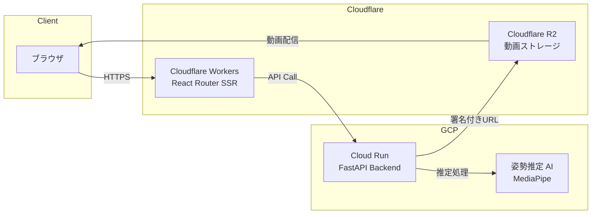

# KenKen 姿勢推定スポーツ分析 (Pose Estimation Sports Analysis)

動画をアップロードしてAIによる姿勢推定とスポーツフォーム分析を行うWebアプリケーションです。


---

## 📐 アーキテクチャ概要

> **Note**: 以下の図は GitHub 上で正しくレンダリングされます。VS Code では [Markdown Preview Mermaid Support](https://marketplace.visualstudio.com/items?itemName=bierner.markdown-mermaid) 拡張機能が必要です。



### システムフロー

1. **SSR (Server-Side Rendering)**: Cloudflare Workers 上で React Router v7 が動作し、初期 HTML をサーバーサイドでレンダリング
2. **状態管理**: クライアント状態 (Zustand) とサーバー状態 (TanStack Query) を明確に分離
3. **動画処理**: アップロード → Cloud Run で姿勢推定 → R2 に結果保存 → 署名付き URL で配信

---

## 🛠 技術選定と理由

| カテゴリ             | 技術               | 選定理由                                                                    |
| -------------------- | ------------------ | --------------------------------------------------------------------------- |
| **フレームワーク**   | React Router v7    | SSR 対応、Cloudflare Workers ネイティブサポート、ファイルベースルーティング |
| **サーバー状態**     | TanStack Query     | キャッシュ戦略、再取得ロジック、ローディング/エラー状態の自動管理           |
| **クライアント状態** | Zustand            | 軽量 (2KB)、ボイラープレート削減、React 外からもアクセス可能                |
| **スタイリング**     | TailwindCSS        | ユーティリティファースト、デザインシステムとの相性、ビルド時の最適化        |
| **ホスティング**     | Cloudflare Workers | エッジ実行による低レイテンシ、グローバル CDN、コスト効率                    |
| **テスト**           | Vitest + RTL       | Vite との統合、高速な HMR、Jest 互換 API                                    |

---

## 🔒 セキュリティへのこだわり

### 環境変数管理

- 機密情報は **Cloudflare Secrets** で管理（Dashboard 経由で設定）
- クライアントバンドルには `VITE_` プレフィックス付きの公開可能な値のみ含める
- サーバーサイド専用の変数は `wrangler.jsonc` の `vars` で定義

### CORS 設計

- バックエンド API は許可されたオリジンのみ受け入れ（`https://kenken-pose-est.online` 等）
- プリフライトリクエストに対応し、クレデンシャル付きリクエストをサポート

### クライアントバンドルの安全性

- API キーやシークレットはクライアントコードに含めない
- 署名付き URL を使用し、R2 への直接アクセスを時間制限付きで許可（Phase 14 で実装予定）

---

## ⚡ パフォーマンス最適化

### レンダリング戦略

- **SSR (Server-Side Rendering)**: 初回ロード時に完全な HTML を返し、FCP (First Contentful Paint) を高速化
- **ハイドレーション**: SSR 後にクライアントサイドで React がアタッチされ、インタラクティブに

### コード分割

- React Router のルートベース分割により、必要なページのコードのみをロード
- 動的インポートで大きなライブラリ (react-player 等) を遅延ロード

### エッジデプロイ

- Cloudflare Workers は世界 300+ のエッジロケーションで実行
- 日本ユーザーには日本のエッジノードから配信、レイテンシを最小化

### バンドルサイズ

- TailwindCSS の PurgeCSS により未使用スタイルを削除
- Tree Shaking で不要な JavaScript を除去

---

## ✅ テスト戦略

### テストピラミッド

```
        /\
       /  \  E2E (将来)
      /----\
     /      \  Integration (RTL)
    /--------\
   /          \  Unit (Vitest)
  /______________\
```

### 現在のカバレッジ

- **目標**: 90% 以上
- **実績**: 94% (2026-01 時点)

### テストツール

| ツール                    | 用途                                |
| ------------------------- | ----------------------------------- |
| **Vitest**                | 単体テスト (hooks, utils, stores)   |
| **React Testing Library** | コンポーネントテスト (ユーザー視点) |
| **happy-dom**             | 軽量な DOM 実装 (jsdom より高速)    |

### 品質チェックワークフロー

```bash
./scripts/quality-check.sh        # TypeCheck, Lint, Test, Build 一括実行
./scripts/quality-check.sh --fix  # Lint 自動修正付き
```

---

## 🚀 Tech Stack

### Frontend

- **Framework:** [React Router v7](https://reactrouter.com/) (SSR Enabled)
- **State Management:**
  - Server State: [TanStack Query (React Query)](https://tanstack.com/query/latest)
  - Client State: [Zustand](https://docs.pmnd.rs/zustand/getting-started/introduction)
- **Styling:** [TailwindCSS](https://tailwindcss.com/)
- **Components:** [Lucide React](https://lucide.dev/) (Icons)
- **Notifications:** [Sonner](https://sonner.emilkowal.ski/) (Toast)

### Testing

- **Unit Testing:** [Vitest](https://vitest.dev/)
- **Integration Testing:** [React Testing Library](https://testing-library.com/docs/react-testing-library/intro/)

### Infrastructure

- **Hosting:** Cloudflare Workers (Pages Functions)
- **Storage:** Cloudflare R2
- **Backend:** Cloud Run (FastAPI) ※別リポジトリ

---

## 🛠 Getting Started

### Prerequisites

- Node.js >= 18.0.0
- npm

### Installation

環境構築セットアップスクリプトを実行してください:

```bash
./scripts/setup.sh
```

### Development

開発サーバーを起動:

```bash
npm run dev
```

アプリケーションは `http://localhost:5173` で起動します。

---

## 🔧 Environment Variables

アプリケーションの動作に必要な環境変数です。`.env` ファイルに設定します。

| 変数名                 | 説明                                         | デフォルト値            |
| :--------------------- | :------------------------------------------- | :---------------------- |
| `VITE_API_BASE_URL`    | バックエンド API のベース URL                | `http://localhost:8000` |
| `VITE_API_TIMEOUT`     | API リクエストタイムアウト (ms)              | `30000`                 |
| `VITE_MAX_VIDEO_SIZE`  | アップロード可能な最大ファイルサイズ (Bytes) | `104857600` (100MB)     |
| `VITE_CF_BEACON_TOKEN` | Cloudflare Web Analytics トークン            | -                       |

### Cloudflare での設定

1. **Cloudflare Dashboard** にアクセス
2. **Workers & Pages** -> 対象のプロジェクトを選択
3. **Settings** -> **Environment variables** を開く
4. **Production** と **Preview** 環境それぞれに変数を追加

---

## 📁 Project Structure

```
app/
├── components/         # UI 構成要素
│   ├── layout/         # MainLayout など
│   ├── ui/             # LoadingSpinner など汎用パーツ
│   └── video/          # ProcessingContainer, UploadDropzone など機能パーツ
├── lib/
│   ├── api/            # APIクライアント設定、エラーハンドリング
│   ├── constants/      # 定数定義 (ファイルサイズ制限等)
│   ├── hooks/          # カスタムフック (useVideoProcessing)
│   ├── providers/      # AppProviders (React Query)
│   ├── services/       # ビジネスロジック
│   ├── stores/         # Zustand ストア
│   └── utils/          # 汎用ユーティリティ (toast 等)
├── routes/             # React Router ルーティング定義
│   └── _index.tsx      # トップページ
├── root.tsx            # アプリケーションルート
└── entry.client.tsx    # クライアントサイドエントリー
```

---

## 🚢 Deployment

本プロジェクトは **Cloudflare Workers** へのデプロイを想定しています。
SSRモードが有効になっているため、`@react-router/cloudflare` アダプターを使用します。

```bash
npm run build
npm run deploy  # Cloudflare にデプロイ
```

---

## 🏃 開発ワークフロー

新機能の開発や修正を行う際の基本的なフローです。

### 1. ブランチ作成

```bash
git checkout develop
git pull origin develop
git checkout -b feature/your-feature-name
```

### 2. 開発サイクル

```bash
npm run dev                    # 開発サーバー起動
npm run test                   # 変更箇所のテスト実行
./scripts/quality-check.sh     # コミット前に必ず実行
```

### 3. コミット & プッシュ

```bash
git add .
git commit -m "feat: 機能の説明"
git push origin feature/your-feature-name
```

### 4. PR 作成

- `develop` ブランチへの PR を作成
- CI が自動実行され、Lint/Test/Build が通過することを確認
- レビューを受けてマージ

---

## 📝 コーディング規約

### ファイル命名

| 種類           | 規約                   | 例                      |
| -------------- | ---------------------- | ----------------------- |
| コンポーネント | PascalCase             | `UploadDropzone.tsx`    |
| フック         | camelCase (use-)       | `useVideoProcessing.ts` |
| ユーティリティ | camelCase              | `toast.ts`              |
| テスト         | 対応ファイル名 + .test | `toast.test.ts`         |
| 定数           | camelCase              | `upload.ts`             |

### コメント言語

- **JSDoc / コードコメント**: 日本語
- **コミットメッセージ**: 英語 (Conventional Commits 形式)
  - `feat:`, `fix:`, `docs:`, `refactor:`, `test:`, `chore:`

### インポート順序

```typescript
// 1. 外部ライブラリ
import { useState } from 'react';
import { useMutation } from '@tanstack/react-query';

// 2. 内部モジュール (@ エイリアス)
import { useVideoStore } from '@/lib/stores/video.store';
import { showSuccess } from '@/lib/utils/toast';

// 3. 相対パス
import { UploadDropzone } from './UploadDropzone';
```

---

## 🔍 トラブルシューティング

### よくある問題と解決策

#### `npm run dev` 時に 504 エラーが出る

Vite のキャッシュが古くなっている可能性があります。

```bash
rm -rf node_modules/.vite
npm run dev
```

#### `CORS policy` エラーが発生する

ローカル環境で Cloudflare Analytics (beacon) が CORS エラーを出すのは正常な動作です。
本番環境では問題なく動作します。

#### テストが失敗する

1. まず最新の依存関係をインストール:
   ```bash
   npm install
   ```
2. TypeScript の型を再生成:
   ```bash
   npm run typegen
   ```
3. テストを再実行:
   ```bash
   npm run test
   ```

#### ビルドが失敗する

```bash
npm run clean      # キャッシュをクリア
npm install        # 依存関係を再インストール
npm run build      # 再ビルド
```

---

## 🔗 関連プロジェクト

このアプリケーションは以下のリポジトリと連携して動作します:

| リポジトリ           | 説明                                      |
| -------------------- | ----------------------------------------- |
| **pose-est-backend** | バックエンド API (FastAPI, Cloud Run)     |
| **pose-est-infra**   | インフラ構成 (Terraform, Cloudflare, GCP) |

### 関連ドキュメント

- [`documents/presigned-url-handover.md`](./documents/presigned-url-handover.md): 署名付き URL アップロード設計
- [`todo-list.md`](./todo-list.md): 開発ロードマップ
- [`guidelines.md`](./guidelines.md): 詳細な開発ガイドライン

---

## 🤝 Contributing

1. このリポジトリをフォーク (または直接クローン)
2. `develop` ブランチから feature ブランチを作成
3. 変更を加え、テストを追加
4. `./scripts/quality-check.sh` が通ることを確認
5. PR を作成し、レビューを依頼

### PR チェックリスト

- [ ] `npm run test` が通る
- [ ] `npm run lint` が通る
- [ ] `npm run build` が通る
- [ ] 新機能には対応するテストを追加した
- [ ] ドキュメント (README / JSDoc) を更新した

---

## © License

All rights reserved.
